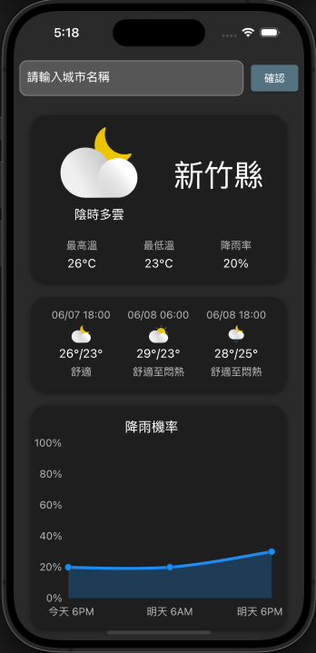

# 天氣應用程式

用於顯示台灣各城市天氣資訊的 Flutter 應用程式。

## 專案結構

```plaintext
enums/
├── taiwan_city.dart
├── weather_type.dart

models/
├── time_weather/time_weather.dart
├── weather/weather_model.dart

providers/
├── weather/weather_provider.dart

screens/
├── error_widget.dart
├── home_page.dart
├── initial_widget.dart
├── loading_widget.dart
├── weather_widget.dart

utils/
├── api_service.dart
├── appLog.dart
├── widget_extension.dart

widgets/
├── city_widget.dart
├── custom_text_field.dart
├── weather_detail.dart
```


### 列舉

- [taiwan_city.dart](lib/enums/taiwan_city.dart): 包含台灣各城市的列舉及其顯示名稱和圖片路徑。
- [weather_type.dart](lib/enums/weather_type.dart): 包含不同天氣類型的列舉及其圖示。


### Model

- [time_weather/time_weather.dart](lib/models/time_weather/time_weather.dart): 定義 `TimeWeather` 模型，表示特定時間段的天氣數據。
- [weather/weather_model.dart](lib/models/weather/weather_model.dart): 定義 `WeatherModel`，包含整體天氣數據結構。

### 狀態管理

- [weather/weather_provider.dart](lib/providers/weather/weather_provider.dart): 包含 `WeatherNotifier` 和 `WeatherState` 類，用於管理天氣數據的狀態。

### 畫面

- [error_widget.dart](lib/screens/error_widget.dart): 顯示錯誤信息的組件。
- [home_page.dart](lib/screens/home_page.dart): 應用程式的主頁。
- [initial_widget.dart](lib/screens/initial_widget.dart): 顯示初始狀態的組件。
- [loading_widget.dart](lib/screens/loading_widget.dart): 顯示加載指示器的組件。
- [weather_widget.dart](lib/screens/weather_widget.dart): 顯示天氣數據的組件。

### 工具

- [api_service.dart](lib/utils/api_service.dart): 包含用於獲取天氣數據的 API 服務。
- [appLog.dart](lib/utils/appLog.dart): 應用程式內的日誌工具。
- [widget_extension.dart](lib/utils/widget_extension.dart): 包含常用組件的擴展。

### 小組件

- [city_widget.dart](lib/widgets/city_widget.dart): 顯示城市選擇的小組件。
- [custom_text_field.dart](lib/widgets/custom_text_field.dart): 自定義文字輸入框組件。
- [weather_detail.dart](lib/widgets/weather_detail.dart): 用於顯示詳細天氣資訊的組件。


## 如何使用

### 開發環境

- Flutter: 3.1.0-0.0.pre.414 (Channel flutter-3.1-candidate.0)
- Dart: 2.18.0 
- macOS: 14.4.1 23E224 darwin-x64

### 安裝

1. Clone：

   ```bash
   git clone https://github.com/tonys61311/weather_app.git
   cd weather_app
   ```
   
2. 安裝依賴：

   ```bash
   flutter pub get
   ```
   
3. 運行應用程式：

   ```bash
   flutter run
   ```

## APP 使用說明

1. 在主頁面中，您可以在輸入框中輸入城市名稱，然後按下「確認」按鈕以獲取指定城市的天氣數據。
2. 您也可以點擊螢幕上顯示的城市圖片來選擇城市。
3. 將顯示選定城市的當前天氣、預測和降雨機率圖表。
4. 如果獲取數據時出現錯誤，將顯示錯誤畫面，並提供返回主頁的按鈕。

## 畫面截圖


### 主頁


### 天氣數據頁


### 錯誤頁面
